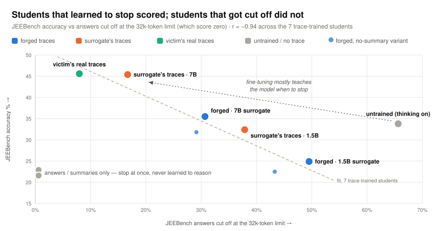

# Can hidden reasoning be stolen? Recreating *Trace Inversion*

**A full recreation of the attack. In this setting, its central result reversed.**

Commercial reasoning models hide their chain of thought and return only an answer, sometimes with a
short summary of the thinking. [*How to Steal Reasoning Without Reasoning Traces*](https://arxiv.org/abs/2603.07267)
(Zhang, Morris, Shmatikov, 2026) says hiding the trace isn't enough. The attacker trains an
**inverter** to run reasoning backwards: given a problem, the answer and the summary, it writes a
trace that could have produced them. A student fine-tuned on these forged traces then beats **plain
distillation**, which fine-tunes the same student on the visible traces of the attacker's own
weaker open model (the **surrogate**).

This repo recreates the experiment end to end (surrogate, inverters, victim and ten students) and
adds a stronger surrogate and a measured noise band. Unlike the paper's, the student here already
reasons natively. Students are scored on **MATH500** (competition math) and **JEEBench** (harder
physics, chemistry and math from India's JEE Advanced exam).

| Victim queries | Models trained | Student evaluations | Compute |
|:-:|:-:|:-:|:-:|
| 5,045 | 4 inverters, 10 students | 13 runs × 1,015 problems | ~258 GPU-hours |

## Result: forged traces lost to plain distillation

<picture>
  <source media="(prefers-color-scheme: dark)" srcset="docs/assets/headline-dark.svg">
  
</picture>

- **In this setting, the paper's core result reversed.** There, forged traces beat plain
  distillation by 8.6 and 16.6 points (+1.4 / +12.9 for its Llama student). Here they lost on both
  benchmarks, both with the paper's own 1.5B surrogate and with a stronger 7B one. Three of the four
  gaps are larger than the evaluation-seed spread; the fourth (MATH500, 1.5B) is a tie.
- **Plain distillation matched the ceiling.** A student distilled from the 7B surrogate
  (72.0 / 45.4) tied one trained on the victim's *real* hidden traces (73.4 / 45.6), although the
  victim itself scores 21 points higher on JEEBench than that surrogate (82.0 on a 250-problem
  subset, vs 60.6). For a 2B student, the teacher was not the limit.
- **The gap is about finishing, not reasoning.** Students trained on forged traces were cut off at
  the 32k-token limit on 29–50 % of JEEBench, against 8 % for the oracle, and cut-off rate alone
  tracks accuracy (r = −0.94). [Why below](#why-the-students-were-learning-to-stop-not-to-reason).

## How the attack works

<picture>
  <source media="(prefers-color-scheme: dark)" srcset="docs/assets/pipeline-dark.svg">
  
</picture>

The inverter is never asked to solve anything, since it is handed the answer. Its only test is
whether the traces it writes make a student better. Every student is the same Qwen3.5-2B,
fine-tuned on one of five kinds of data:

| Training data | Role |
|---|---|
| the victim's answers only | floor: what the attacker sees |
| the victim's summaries + answers | floor: what the attacker sees |
| **forged traces** from the inverter | **the attack** |
| the surrogate's own traces | plain distillation, the alternative the attack must beat |
| the victim's real traces | the oracle, an upper bound no real attacker has |

Victim-side students train on the 3,616 problems where all four inverters produced a finished
trace; the plain-distillation students train on 3,616 of the surrogate's own problems. Every result
file passed an automated gate before any number from it was used, and the gates caught three silent
failures, including a chat template that quietly disabled thinking. The full record of every phase
is in [`docs/results/`](docs/results/).

## Every student, side by side

<picture>
  <source media="(prefers-color-scheme: dark)" srcset="docs/assets/results-dark.svg">
  
</picture>

1. **Traces beat no traces.** Every trace-trained student clears the answers-only floor on MATH500
   by at least 6 points.
2. **With the paper's own 1.5B surrogate, forgeries did no better than no trace at all.** On
   JEEBench those students scored 24.9 / 22.5 (with / without summary), against 22.9 for answers
   alone.
3. **A stronger surrogate helped at every stage.** With the 7B surrogate, the inverters finished
   more often, about half as many forgeries had to be discarded, and the students scored higher.

<details>
<summary><strong>All 13 evaluation runs</strong></summary>

| Student trained on | MATH500 | JEEBench | JEEBench answers cut off at the 32k cap |
|---|---|---|---|
| nothing, thinking **off** (baseline run before the study, cited) | 79.0 | 47.8 | — |
| nothing, thinking **on** (how every student is served) | 67.8 | 33.8 | 65.6 % |
| the victim's answers only | 54.2 | 22.9 | 0.6 % |
| the victim's summaries + answers | 54.8 | 21.6 | 0.6 % |
| forged traces, 7B surrogate (with / without summary) | 64.4 / 67.0 | 35.5 / 31.8 | 30.7 / 29.1 % |
| forged traces, 7B surrogate, LoRA instead of full fine-tune | 68.0 | 35.5 | 28.7 % |
| forged traces, 1.5B surrogate (with / without summary) | 61.0 / 61.2 | 24.9 / 22.5 | 49.5 / 43.3 % |
| the surrogate's own traces, 7B | **72.0** | **45.4** | 16.7 % |
| the surrogate's own traces, 1.5B | 62.2 | 32.4 | 37.9 % |
| the victim's real traces (oracle) | **73.4** | **45.6** | 8.0 % |
| forged, 7B with summary: evaluation seeds 1234 / 1235 / 1236 | 64.4 / 67.8 / 65.8 | 35.5 / 37.9 / 32.6 | — |

Giving the inverter the summary made no measurable difference; neither did LoRA vs full
fine-tuning. Full record: [`docs/results/phase6.md`](docs/results/phase6.md).

</details>

## Why: the students were learning to stop, not to reason

<picture>
  <source media="(prefers-color-scheme: dark)" srcset="docs/assets/termination-dark.svg">
  
</picture>

**No student beat the untrained model with thinking switched off (79.0 / 47.8), the oracle
included.** Untrained, in thinking mode, the student keeps going until it is cut off at the
32k-token limit on two thirds of JEEBench, and a cut-off answer scores zero; 88 % of the answers it
does finish are right. Every student is served in thinking mode, so fine-tuning here mostly taught
the model to stop. Comparisons *between* students stay valid, since all were measured the same way,
but the question they answer is "which data best repairs a reasoning model?", not the paper's
"which data teaches reasoning to a model that can't?"

Among the seven trace-trained students, cut-off rate tracks accuracy at r = −0.94. Students trained
on the victim's real traces finish 92 % of JEEBench, those distilled from the 7B surrogate 83 %, and
those trained on forged traces only 50–71 %.

**Length alone doesn't explain it.** Counting trace plus answer, the surrogate's own training
examples are as long as the forged ones (median ~3.0–3.4k vs ~2.9–3.2k tokens), yet the
7B-distilled student is cut off half as often. The difference is how forgeries are made: written
backwards from an answer the inverter was handed, in the surrogate's voice rather than the
victim's, and 4–9 % of them argue their way to a different answer from the one attached. They also
overshoot the real traces they replace (median trace 2.2–2.6× longer), where the paper's came in
*under* the real length (81–89 %).

## What it means

**The takeaway:** a distillation attack is only as convincing as its baseline. The paper's
plain-distillation student scored *below* its own untrained student (63.2 vs 71.2 on MATH500, 19.7
vs 28.3 on JEEBench), so beating it was a low bar: on MATH500 the forged-trace student only got back
to the untrained level (71.8 vs 71.2), though on JEEBench it did clear it (36.3 vs 28.3). Here,
against a strong baseline and a student that already reasons, the real hidden traces were worth no
more than an open 7B model's, and the forgeries were worse still. Their flaws, overlong and
sometimes self-contradicting, were measurable before a single student was trained. **Anchor a
distillation attack to the best no-training baseline, and inspect forged traces before you train
on them.**

**What's settled, and what isn't:**

- **Settled:** the attack as built lost to plain distillation, on both benchmarks and with both
  surrogates.
- **Not separable:** *why*. Forged and real traces differ in length, voice and answer consistency,
  the distillation students saw different problems and answers, and no length-matched control was
  run.
- **Noise:** each condition was trained once, and the measured band (3.4 MATH500, 5.3 JEEBench) is
  evaluation-seed spread only. The paper reports single runs; its "forged beats the oracle" margins
  (0.4–2.4 points on these benchmarks) sit inside that band.
- **The 32k cap matters:** about half of the untrained model's JEEBench cut-offs were not strict
  loops and might finish with a larger budget.
- **Scale:** the models are smaller and newer than the paper's, so compare signs, not sizes.

## Future work

- **Length-matched control.** Trim or resample the forgeries to the real traces' length
  distribution, to separate length from voice and content.
- **The paper's question.** Repeat with a student that can't reason natively, and train the
  distillation students on the same victim-side problems.
- **Training seeds.** Three per key condition; the current noise band covers evaluation only.

<details>
<summary><strong>Deviations from the paper</strong></summary>

The paper ran on 8× A100 80 GB against a 685B victim. Most of what changed follows from 24 GB of
VRAM. Full log with reasons: [`docs/09-deviations-from-paper.md`](docs/09-deviations-from-paper.md).

| | Paper | Here | Why |
|---|---|---|---|
| Victim | DeepSeek-R1 (685B) | Qwen3.8-27B, 4-bit GGUF, local | R1 can't run in 24 GB |
| Surrogate | R1-Distill-Qwen-1.5B | same 1.5B, plus a 7B | adds a surrogate-strength midpoint |
| Compressor / inverter | Qwen2.5-7B-Instruct, full SFT | Qwen3.5-4B, LoRA r=64 | 7B full fine-tuning needs ~58 GB |
| Student | Qwen2.5-7B, Llama-3.1-8B, full SFT | Qwen3.5-2B, full SFT at 16k context | fits full fine-tuning, matching the paper's method |
| Data | 2 × 10k prompts | 2 × 5k | the paper's scaling curve: 5k gives most of the gain |
| Framework | LLaMA-Factory + DeepSpeed | TRL `SFTTrainer` | single-GPU training |
| Evaluation | unspecified sampling, single run | one harness for all 13 runs, 32k cap, 3 evaluation seeds on one cell | comparability |
| Trace-similarity metrics | BLEU / token-F1 / ROUGE | not run | in the paper they track trace length (r ≈ 0.9); student accuracy is the real test |

</details>

<details>
<summary><strong>Repository layout</strong></summary>

```
bench/            every script that generates, trains, evaluates or gates
  results/        committed JSON records (raw generations are gitignored)
docs/
  00–04           the paper: method, experiments, artifacts, defenses
  05–10           this machine: feasibility, model choice, deviations, run plan
  11–17           per-phase plans
  results/        measured record of every phase, plus sweeps and audits
  assets/         README figures and make_charts.py, which draws them from the records
```

Three separate stacks: `llama.cpp` serves the victim and surrogates, vLLM handles batched inference
and evaluation, and TRL handles training. Regenerate the figures with
`python3 docs/assets/make_charts.py`; it reads `bench/results/phase6/summary.json` and checks
the headline numbers against it.

</details>
