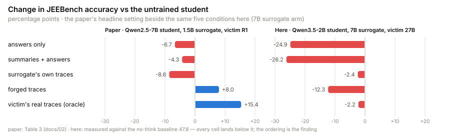
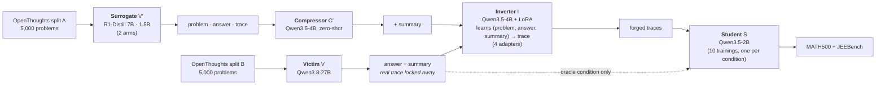

# Trace Inversion, reproduced on one GPU

**Can you steal a model's reasoning from the parts it shows you?**

Commercial reasoning models hide their chain of thought and return only the final answer plus,
sometimes, a short summary of the thinking. The bet is that hiding the trace stops competitors from
distilling the reasoning. [*How to Steal Reasoning Without Reasoning Traces*](https://arxiv.org/abs/2603.07267)
(Zhang, Morris, Shmatikov — Cornell Tech, 2026) argues the bet is lost: train a model to run
reasoning **backwards** — given a problem, its answer and the summary, write the trace that would
have produced them — and the forged traces are good enough to train a student on. In the paper, a
student fine-tuned on forgeries goes most of the way to one trained on the victim's *real* traces,
and beats a student trained on a weaker model's real traces.

This repository reproduces that pipeline end to end on **one RTX 4090** with a **local victim**, so
the victim's real traces exist on disk — withheld from the attack, and used only to train the
ceiling condition the paper could never run against its own black-box victim.

## The result

**Forged traces lost to plain distillation.** Trained on the forgeries, the student scored below
a student trained on the surrogate's own traces — the trivial alternative the attack is meant to
beat — on both benchmarks and both surrogate sizes, and well below the student trained on the
victim's real traces. And *no* trained student, oracle included, beat the untrained model with
thinking switched off.

<picture>
  <source media="(prefers-color-scheme: dark)" srcset="docs/assets/results-dark.svg">
  
</picture>

| Student trained on | MATH500 | JEEBench | JEEBench answers cut off at the cap |
|---|---|---|---|
| nothing — thinking **off** (the template's default) | **79.0** | **47.8** | — |
| nothing — thinking **on** (how every student is served) | 67.8 | 33.8 | 65.6 % |
| the victim's answers only | 54.2 | 22.9 | 0.6 % |
| the victim's summaries + answers | 54.8 | 21.6 | 0.6 % |
| **forged traces**, 7B surrogate arm (with / without summary) | 64.4 / 67.0 | 35.5 / 31.8 | 30.7 / 29.1 % |
| **forged traces**, 1.5B surrogate arm (with / without summary) | 61.0 / 61.2 | 24.9 / 22.5 | 49.5 / 43.3 % |
| the surrogate's own traces — 7B | **72.0** | **45.4** | 16.7 % |
| the surrogate's own traces — 1.5B | 62.2 | 32.4 | 37.9 % |
| the victim's real traces (oracle) | **73.4** | **45.6** | 8.0 % |

Three evaluation seeds on one forged cell put the noise band at **3.4 points on MATH500 and 5.3
on JEEBench**; the gaps the claims below rest on are 1.4–2.6× that band, and the one gap inside
it (distilling the 7B surrogate vs the oracle, 1.4 / 0.2 points) is called a tie.

What the table says:

1. **Inversion added nothing over distillation.** Per surrogate arm, the forged-trace student
   trails the plain-distillation student by 5–8 MATH500 and 10–14 JEEBench points (7B arm), and
   by 8–10 JEEBench points on the 1.5B arm (MATH500 a tie there). The paper's core claim runs
   the other way.
2. **Distilling a mid-strength surrogate matched the oracle.** The 7B surrogate scores 60.6 on
   JEEBench itself; a student trained on its traces (45.4) tied the student trained on the
   27B victim's real traces (45.6), at half the truncation rate.
3. **Nothing taught the student to reason better than it already could.** Every trained row sits
   below the no-think baseline; what training demonstrably taught is *termination* — how to close
   a think block instead of looping to the 32k-token cap, which the untrained model does on two
   thirds of JEEBench. The next two sections are why.

## Against the paper

<picture>
  <source media="(prefers-color-scheme: dark)" srcset="docs/assets/paper-vs-ours-dark.svg">
  
</picture>

Same five conditions, same benchmark, opposite ordering. Three differences in the setup account
for it, and all three are on the record rather than guessed:

- **The student already reasons.** The paper's students (Qwen2.5-7B, Llama-3.1-8B) predate
  reasoning models; ours (Qwen3.5-2B) thinks natively, and thinking mode alone costs it
  11–14 points because it loops. The claim therefore shifts from "inversion *instills* reasoning"
  to "inversion *improves* it" — and against a model that reasons, forgeries had nothing to add.
- **The forgeries were the wrong length and the wrong voice.** The 27B victim writes terse
  working notes (median 1,400 tokens); the inverters, trained on a talkative surrogate, wrote
  forgeries **2.2–2.6× longer** than the real traces on the same problems, in R1-Distill's
  "Okay, so…" monologue. The paper's forgeries approached the truth from *below* (81–89 % of its
  length); ours overshot from above.
- **The paper's margins are inside our noise.** Its headline gaps are 0.4–2.4 points on single
  runs; our measured seed band is 3.4 / 5.3. A single-seed reproduction of those gaps could not
  distinguish them from noise on this hardware either way.

## Why the forgeries lost: they taught the student to ramble

<picture>
  <source media="(prefers-color-scheme: dark)" srcset="docs/assets/termination-dark.svg">
  
</picture>

Accuracy tracks termination almost exactly. The untrained model loops to the cap on 65.6 % of
JEEBench; every trained student loops less, in proportion to how short its training traces were:
answer-only ≤ 1 %, oracle 8 %, forged traces from the 7B arm ~30 %, from the 1.5B arm 43–50 %.
The forged-trace students were trained on completions **1.8–2.0× longer** than the oracle's on
the same rows, and they learned the length. Surrogate strength then propagates through the whole
pipeline into student *behaviour*, not just accuracy: the weaker arm's inverters capped twice as
often, its forgeries were rescued from loopier draws, and its students loop ~1.7× more than the
7B arm's.

## How the attack works



| Role | Here | Trained? | How many | Job |
|---|---|---|---|---|
| **Victim** | Qwen3.8-27B, 4-bit, llama.cpp | never | 1 | The strong model being stolen from. Shows a summary, hides its trace. |
| **Surrogate** | R1-Distill-Qwen-**7B** and **-1.5B** | never | **2 arms** | A weaker reasoner we can watch. Exists only to manufacture the inverter's training data. |
| **Compressor** | Qwen3.5-4B, zero-shot | never | 1 | Writes a victim-style summary of each surrogate trace. |
| **Inverter** | Qwen3.5-4B + LoRA | **yes** | **4** — {7B, 1.5B arm} × {summary, no summary} | Learns *(problem, answer[, summary]) → trace*, then is pointed at the victim's outputs. |
| **Student** | Qwen3.5-2B, full fine-tune | **yes** | **10** — one per condition, every one on the same 3,616 problems | The model being improved. |

The inverter is never benchmarked and never asked to solve anything — it is handed the answer.
Its only test is whether the traces it writes make the student better.

Two things the paper couldn't do: an **oracle row from the same victim that was attacked** (its
black-box victim never exposed a trace), and a **midpoint on surrogate strength** — it compared a
1.5B distill with 685B R1; we run the 1.5B (its exact model) and a 7B under identical settings.

## Findings along the way

Full detail in `docs/results/`. The ones that would bite anyone repeating this:

- **A chat template is part of the experiment.** Qwen3.5-4B thinks by default; Qwen3.5-2B ships
  with thinking *off* and renders a closed think block unless asked. Caught in a round-trip gate
  before training — and it ran backwards too: the original student baseline was a no-think
  render, so the thinking-mode baseline had to be re-measured before any before/after claim.
- **Checkpoints that load are not checkpoints that serve.** transformers 5.16 reverts its own
  key renaming on save, so every full-fine-tune student loaded in transformers and was rejected
  by vLLM; serving copies with the prefix stripped fixed it, tensors byte-identical.
- **The victim was silently being asked for maximum effort.** With no system prompt, the GGUF's
  template injects a "reasoning effort: xhigh" turn. `medium` — the only level that renders no
  system turn — halved the cap-hit rate and cut a projected ~145 h victim run to 66 h.
- **Capability shows up as brevity.** The 27B victim scores 86 on JEEBench in a median ~3,500
  tokens; the 4B takes ~22,000 and scores 74; the 2B, thinking, hits the 32k cap.
- **A weaker surrogate doesn't produce longer training data — it produces a bigger discard
  pile.** Traces that hit the 8,192-token cap are dropped. The 1.5B caps 46 % of prompts to the
  7B's 35 %, yet the *surviving* traces are the same length; all the extra verbosity is in the tail.
- **The inverters cannot finish what the victim starts.** On surrogate data they cap 3–17 % of
  the time; on the victim's fully-worked answers, 21–38 % — and 9.5–19 % of problems never
  terminate in three draws, twice as often on code as on math.
- **A forged trace sometimes argues itself out of the answer it was handed** — 4–9 % of graded
  forgeries conclude something other than the answer they were conditioned on. Left unfiltered,
  as in the paper.

## Cost

| Phase | GPU hours |
|---|---|
| 0 — baselines | ~30 |
| 1 — surrogate data, both arms | ~30 |
| 2 — train 4 inverters | ~28 |
| 3 — query the victim (5,045 traces) | **~79** |
| 4 — forge 4 trace sets | ~28 |
| 5 — train 10 students | ~27 |
| 6 — evaluate 13 runs | ~36 |
| **Total** | **~258 h** — about eleven days on one RTX 4090 |

## Caveats

- Different victim, student and surrogate sizes than the paper, so **absolute numbers are not
  comparable to its tables**; the orderings are what's being compared.
- **Oracle-vs-forged gaps carry three confounds** besides trace content: supervision length
  (1.8–2.0×), register, and 4–9 % answer inconsistency. The plain-distillation cells differ from
  the victim-trained cells in rows and answer source as well as trace source. "The pipeline as
  built underperforms the trivial alternative" is settled; *why* is not fully separable.
- One training seed per condition; the evaluation band was measured on one cell.
- 5,000 victim queries per split against the paper's 10,000; its own scaling curve shows 5k
  delivers most of the MATH500 gain.

<details>
<summary><strong>How this differs from the paper</strong></summary>

The paper ran on 8× A100 80 GB with a 685 B victim. Everything below follows from 24 GB of VRAM.
The running log with the reason and expected effect of each is `docs/09-deviations-from-paper.md`.

| | Paper | Here | Why |
|---|---|---|---|
| Victim | DeepSeek-R1 (685 B) via API; GPT-5.4 mini | Qwen3.8-27B, 4-bit GGUF, local | R1 is unrunnable at any quantization; a local victim gives the oracle row |
| Surrogate | R1-Distill-Qwen-1.5B (and R1) | same 1.5B, plus a 7B as primary | the 1.5B scores *below* our student on JEEBench; the 7B restores the paper's ordering and adds the midpoint |
| Compressor / inverter base | Qwen2.5-7B-Instruct | Qwen3.5-4B | 7B full fine-tuning is ~58 GB; the 4B fits with LoRA at 18 GB |
| Inverter training | full-parameter SFT | bf16 LoRA, r=64, lr 1e-4 | 4B full fine-tuning measured at 27.8 GB |
| Student | Qwen2.5-7B-Instruct, Llama-3.1-8B, full SFT | Qwen3.5-2B, full SFT at the paper's 16,384 context (+ one LoRA twin, which scored the same) | fits full fine-tuning, so the method matches; it already reasons, so the claim becomes "inversion *improves* reasoning" |
| Data | 2 × 10 k prompts | 2 × 5 k | the paper's own scaling curve shows 5 k delivers most of the MATH500 gain |
| Framework | LLaMA-Factory + DeepSpeed | TRL `SFTTrainer` | translated, not copied — the two frameworks' defaults differ |
| Evaluation | benchmark defaults, unspecified sampling | one harness for every model: 32k cap, paper sampling, seed 1234, `enable_thinking=True` | comparability across the 13 runs and with the Phase 0 baseline |
| Trace-fidelity metrics | BLEU / TF1 / ROUGE against the victim's real traces | not run | across the paper's own results they track trace *length* at r ≈ 0.9; student accuracy carries the result |
| Seeds / variance | none reported | 3 evaluation seeds on one cell: band 3.4 / 5.3 points | the paper's headline margins (0.4–2.4) sit inside that band |

</details>

<details>
<summary><strong>Phase-by-phase records</strong></summary>

Each phase was run from a ≤4,000-character goal prompt (`docs/PHASE*-GOAL.txt`) against a
numbered handoff document, with a supervising session auditing every checkpoint. The measured
record of each phase supersedes its plan wherever they disagree.

| Phase | Plan | Record |
|---|---|---|
| 0 — baselines | `docs/10-run-plan.md` | `docs/results/baselines.md` |
| 1 — surrogate data | `docs/11-phase1-handoff.md` | `docs/results/phase1.md` |
| 2 — train the inverters | `docs/13-phase2-handoff.md` | `docs/results/phase2.md` |
| 3 — query the victim | `docs/14-phase3-handoff.md` | `docs/results/phase3.md` |
| 4 — invert | `docs/15-phase4-handoff.md` | `docs/results/phase4.md` |
| 5 — train the students | `docs/16-phase5-handoff.md` | `docs/results/phase5.md` |
| 6 — evaluate | `docs/17-phase6-handoff.md` | `docs/results/phase6.md` |

`docs/00`–`04` cover the paper itself (method, experiments, artifacts, defenses); `docs/05`–`08`
this machine (feasibility, model selection, the released code, measured throughput); `docs/09` every
deviation; `docs/10` the run plan and the four questions every proposed experiment must answer.

</details>

<details>
<summary><strong>Repository layout and running it</strong></summary>

```
bench/                  the harness — every script that generates, trains, measures or gates
  phase1/               pinned prompts (verbatim from the paper's repo, sha256-asserted) and the split manifest
  results/              raw outputs (gitignored — they embed full generated text); committed: the small JSON records
docs/
  assets/               the README charts and the script that draws them from bench/results/phase6/summary.json
  results/              committed measurements: baselines, phase1–phase6, sweeps, audits
```

Three stacks, deliberately separate: `llama.cpp` (`llama-server`, GGUF) for the victim and
surrogates; `.venv-vllm` for batched inference and evaluation with vLLM; `.venv` for training with
TRL. vLLM pins its own torch and never goes in the training venv.

Every long run was preceded by a probe whose projection was reported before the run started, and
every result file went through a gate before a number from it was believed. The conventions that
came out of doing this the hard way are in `docs/11-phase1-handoff.md` §5.

</details>
