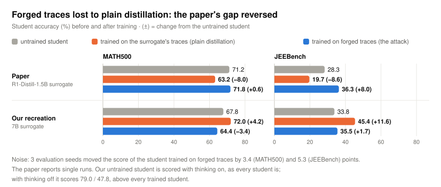
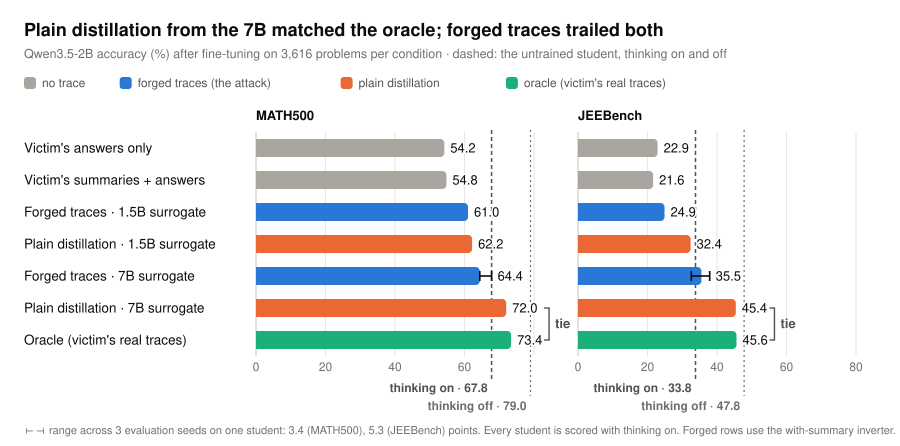

# Can hidden reasoning be stolen? Recreating *Trace Inversion*

**We recreated the paper's attack end to end. In our recreation, its central result reversed.**

The cheapest way to copy a strong model's reasoning is to train a smaller model on its reasoning
traces, the step-by-step working behind each answer. That's why commercial reasoning models hide
those traces and return only an answer, sometimes with a short summary. The paper,
[*How to Steal Reasoning Without Reasoning Traces*](https://arxiv.org/abs/2603.07267) (Zhang,
Morris, Shmatikov, 2026), says hiding them isn't enough: an attacker can **reconstruct** the hidden
traces and train on those instead. It trains an **inverter** to run reasoning backwards: given a
problem, the answer and the summary, it writes a trace that could have produced them. In the paper,
a student trained on these forged traces beats **plain distillation**, which trains the same
student on the visible traces of the attacker's own weaker open model (the **surrogate**).

**Our recreation** runs the whole attack end to end (surrogate, inverter, victim and students) and
adds a measured evaluation-noise band. Students are scored on **MATH500** (competition math) and
**JEEBench** (harder physics, chemistry and math from India's JEE Advanced exam).

**The models in our recreation:**

| Role | Model | What it does |
|---|---|---|
| **Victim** | Qwen3.8-27B | The strong model being stolen from. The attacker sees only its answer and a short summary (made by our compressor); its reasoning stays hidden. |
| **Surrogate** | R1-Distill-Qwen-7B | An open, weaker model whose reasoning the attacker can see. |
| **Compressor** | Qwen3.5-4B | Summarizes reasoning traces: the surrogate's, to train the inverter, and the victim's hidden ones, since our victim has no summary feature. |
| **Inverter** | Qwen3.5-4B + LoRA | Learns from the surrogate to write reasoning backwards from an answer and summary, then forges the victim's hidden reasoning. |
| **Student** | Qwen3.5-2B | The small model being trained and scored. Unlike the paper's students, it already reasons natively, with a thinking mode that can be switched on or off. |

**The students:** every student is the same Qwen3.5-2B, fine-tuned on one kind of data.

| Student trained on | Why it's in the study |
|---|---|
| nothing (the untrained student) | the starting point |
| the victim's answers only | no reasoning: what the attacker sees |
| the victim's summaries + answers | no reasoning: what the attacker sees |
| **forged traces**: the inverter's forgeries of the victim's hidden reasoning | **the attack** |
| **the surrogate's traces** (plain distillation) | what an attacker can do anyway: the baseline the attack must beat |
| **the victim's real traces** | the best case, which no real attacker has; possible only because we ran the victim ourselves |

| Victim answers kept | Students trained | Student evaluations | Compute |
|:-:|:-:|:-:|:-:|
| 5,045 | 10 | 13 runs × 1,015 problems | ~258 GPU-hours |

## Result: in our recreation, forged traces lost to plain distillation

<picture>
  <source media="(prefers-color-scheme: dark)" srcset="docs/assets/headline-dark.svg">
  
</picture>

We also tested the paper's 1.5B surrogate; both forged traces and plain distillation left our
student worse off, so we use a 7B.

- **The paper's result reversed in our recreation.** In the paper, forged traces beat plain
  distillation by 8.6 (MATH500) and 16.6 (JEEBench) points (+1.4 / +12.9 for its Llama student).
  In our recreation, plain distillation beat forged traces by 7.6 and 9.9, both outside the noise
  band.
- **In our recreation, training on the surrogate's traces matched training on the victim's real
  ones.** The student trained on the surrogate's traces (72.0 / 45.4) tied the student trained on
  the victim's real traces (73.4 / 45.6), although the victim itself scores 21 points higher on
  JEEBench than the 7B surrogate (next chart).
- **In our recreation, the students trained on forged traces often never finished.** On JEEBench
  they were cut off at the 32k-token limit on 29–31 % of problems, against 17 % for the student
  trained on the surrogate's traces and 8 % for the one trained on the victim's real traces. Across
  all four students trained on reasoning traces, cut-off rate tracks accuracy (r = −0.91). A cut-off
  answer scores zero, so part of that link is by construction.
  [Details below](#where-the-gap-shows-up-students-that-dont-finish).

## How far each student got toward the victim

<picture>
  <source media="(prefers-color-scheme: dark)" srcset="docs/assets/results-dark.svg">
  
</picture>

In our recreation, the students trained on the surrogate's traces and on the victim's real traces
closed the same share of the gap between our untrained student and the victim on JEEBench (24 % each; on MATH500, 14 % vs 19 %, a 1.4-point gap
inside the noise band). The victim scores 21 points above the 7B surrogate on JEEBench, yet its real
traces moved our student no further than the surrogate's. The student trained on forged traces
closed 4 % on JEEBench,
inside the noise band, and fell below the untrained student on MATH500.

Forged traces did beat what the attacker can see: the student trained on them scored about 10 points
above the students trained on the victim's answers or summaries on MATH500, and about 13 on
JEEBench (64.4 vs 54.2–54.8; 35.5 vs 21.6–22.9).

<details>
<summary><strong>All evaluation runs in our recreation (7B surrogate)</strong></summary>

| Student trained on | MATH500 | JEEBench | JEEBench answers cut off at the 32k-token limit |
|---|---|---|---|
| nothing, thinking **off** (baseline run before the study, cited) | 79.0 | 47.8 | — |
| nothing, thinking **on** (how every student is scored) | 67.8 | 33.8 | 65.6 % |
| the victim's answers only | 54.2 | 22.9 | 0.6 % |
| the victim's summaries + answers | 54.8 | 21.6 | 0.6 % |
| forged traces (with / without summary) | 64.4 / 67.0 | 35.5 / 31.8 | 30.7 / 29.1 % |
| forged traces, LoRA instead of full fine-tune | 68.0 | 35.5 | 28.7 % |
| the surrogate's traces (plain distillation) | **72.0** | **45.4** | 16.7 % |
| the victim's real traces | **73.4** | **45.6** | 8.0 % |
| forged traces with summary: evaluation seeds 1234 / 1235 / 1236 | 64.4 / 67.8 / 65.8 | 35.5 / 37.9 / 32.6 | — |

Giving the inverter the summary made no measurable difference; neither did LoRA vs full
fine-tuning (identical on JEEBench; +3.6 on MATH500, at the edge of the 3.4 seed range). The runs
with the paper's 1.5B surrogate are in the full record:
[`docs/results/phase6.md`](docs/results/phase6.md).

</details>

## How the attack works

<picture>
  <source media="(prefers-color-scheme: dark)" srcset="docs/assets/pipeline-dark.svg">
  
</picture>

The inverter is never asked to solve anything, since it is handed the answer. Its only test is
whether the traces it writes make a student better.

The students trained on the victim's data (its answers, summaries, forged traces or real traces)
all use the same 3,616 problems, those where every inverter produced a finished trace; the student
trained on the surrogate's traces uses 3,616 of the surrogate's own problems. Every result
file passed an automated gate before any number from it was used, and the gates caught three silent
failures, including a chat template that quietly disabled thinking. The full record of every phase
is in [`docs/results/`](docs/results/).

## Where the gap shows up: students that don't finish

<picture>
  <source media="(prefers-color-scheme: dark)" srcset="docs/assets/termination-dark.svg">
  
</picture>

Untrained and in thinking mode, our student is cut off at the 32k-token limit on two thirds of
JEEBench, so in our recreation every student is partly learning to *finish* its reasoning.
Fine-tuning's clearest effect was on whether a student finished: the students that finished least
scored lowest.

**Length alone doesn't explain the gap to plain distillation.** Counting trace plus answer, the
surrogate's own training examples are as long as the forged ones (median ~3.4k vs ~3.0–3.2k
tokens), yet the student trained on the surrogate's traces is cut off about half as often. One visible difference
is how they were made: the surrogate's traces end at its own answer, while forgeries are written
backwards toward an answer the inverter was handed, and about 5 % of them argue their way to a
different one. The two sets also cover different problems, so this is a candidate explanation, not
a measured cause. Our forgeries also overshoot the real traces they replace (median 2.4–2.6×
longer), where the paper's came in *under* the real length (81–89 %). Both flaws were on record
before any student trained.

## What it means

**The takeaway: an attack on hidden reasoning is only as convincing as its weakest baseline.** In
the paper, the margins were measured against a student trained with plain distillation that scored
below the untrained student. In our recreation, plain distillation from an open 7B matched the victim's real
traces and left forging little room, and for a student that already reasons, fine-tuning mainly
taught it to finish its reasoning. So credit a trace-stealing attack only if it beats both the
untrained student and plain distillation from the best open model. The evidence, from both sides:

**The paper: much of its margin was recovered ground.** Its student trained with plain distillation scored 63.2
vs its untrained student's 71.2 on MATH500 and 19.7 vs 28.3 on JEEBench. Measured against its
untrained student, forging's +8.6 on MATH500 shrinks to +0.6 (71.8 vs 71.2); on JEEBench forging
did clear it (36.3 vs 28.3).

**Our recreation: forged traces beat neither baseline.** They trailed plain distillation, and no
student trained on forged traces beat our untrained student (thinking on) by more than the seed spread (at most
+0.2 MATH500 and +1.7 JEEBench; the with-summary forged student's mean over three evaluation seeds
is +1.5 on JEEBench).

**What isn't settled in our recreation:**

- **Not separable:** *why*. Our forged and real traces differ in length, voice and answer
  consistency, the student trained on the surrogate's traces saw different problems and answers, and no
  length-matched control was run.
- **Noise:** each condition was trained once, and the band we measured (3.4 MATH500, 5.3 JEEBench)
  is evaluation-seed spread only. The paper reports single runs; its margins where forged traces beat the victim's real traces
  margins (0.4–2.4 points on these benchmarks) would sit inside our band. The headline gaps are
  differences of two runs, so their noise band is about √2 wider (4.8 / 7.5); both of our gaps
  (7.6, 9.9) are outside it.
- **Data:** our students train on 3,616 problems, about a third of the paper's 10k. The paper's own
  scaling curve (a different victim, no plain-distillation comparison) puts its attack 10.6 points
  lower on MATH500 at 5k than at 10k, so the margin of forged traces over plain distillation may
  depend on scale. Whether it
  would change sign is untested.
- **The 32k-token limit matters:** about half of our untrained student's JEEBench cut-offs were not
  stuck repeating themselves and might finish with a larger budget.
- **Scale:** our models are smaller and newer than the paper's, so compare directions, not sizes.

## Future work

- **Length-matched control.** Trim or resample our forgeries to the real traces' length
  distribution, to separate length from voice and content.
- **The paper's question.** Repeat with a student that can't reason natively, and train the
  student on the surrogate's traces using the same problems as the other students.
- **Training seeds.** Three per key condition; our current noise band covers evaluation only.

<details>
<summary><strong>How our recreation differs from the paper</strong></summary>

The paper ran on 8× A100 80 GB against a 685B victim. Most of what changed in our recreation follows
from 24 GB of VRAM. Full log with reasons:
[`docs/09-deviations-from-paper.md`](docs/09-deviations-from-paper.md).

| | Paper | Our recreation | Why |
|---|---|---|---|
| Victim | DeepSeek-R1 (685B) | Qwen3.8-27B, 4-bit GGUF, local | R1 can't run in 24 GB |
| Surrogate | R1-Distill-Qwen-1.5B | R1-Distill-Qwen-7B (the 1.5B was also run) | the 1.5B scores below our student on JEEBench |
| Compressor / inverter | Qwen2.5-7B-Instruct, full SFT | Qwen3.5-4B (compressor zero-shot; inverter LoRA r=64) | 7B full fine-tuning needs ~58 GB |
| Student | Qwen2.5-7B, Llama-3.1-8B, full SFT | Qwen3.5-2B, full SFT at 16k context | fits full fine-tuning; reasons natively, which changes the question (see top) |
| Data | 2 × 10k prompts | 2 × 5k queried; students train on 3,616 | cost. The paper's own curve (GPT-5.4 mini victim) falls from 77.6 to 67.0 on MATH500 at 5k, below its untrained 71.2 |
| Framework | LLaMA-Factory + DeepSpeed | TRL `SFTTrainer` | single-GPU training |
| Evaluation | unspecified sampling, single run | one harness for all 13 runs, 32k-token limit, 3 evaluation seeds on one student | comparability |
| Trace-similarity metrics | BLEU / token-F1 / ROUGE | not run | across the paper's six Table 2 rows they track trace length (r = 0.84–0.95, n = 6, [`docs/10`](docs/10-run-plan.md)); student accuracy is the real test |

</details>

<details>
<summary><strong>Repository layout</strong></summary>

```
bench/            every script that generates, trains, evaluates or gates
  results/        committed JSON records (raw generations are gitignored)
docs/
  00–04           the paper: method, experiments, artifacts, defenses
  05–10           this machine: feasibility, model choice, deviations, run plan
  11–17           per-phase plans
  results/        measured record of every phase, plus sweeps and audits
  assets/         README figures and make_charts.py, which draws them from the records
```

Three separate stacks: `llama.cpp` serves the victim and surrogates, vLLM handles batched inference
and evaluation, and TRL handles training. Regenerate the figures with
`python3 docs/assets/make_charts.py`; it reads `bench/results/phase6/summary.json` and checks
the headline numbers against it.

</details>
