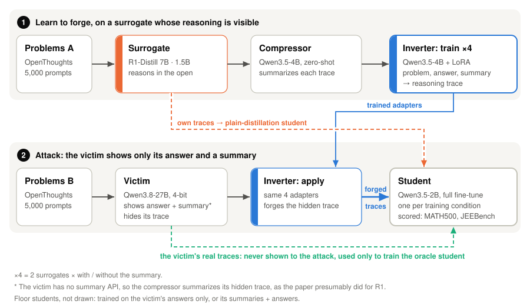

# Trace Inversion, reproduced on one GPU

**Can you steal a model's hidden reasoning from the parts it does show you?**

Commercial reasoning models hide their chain of thought and return only an answer, sometimes with a
short summary. [*How to Steal Reasoning Without Reasoning Traces*](https://arxiv.org/abs/2603.07267)
(Zhang, Morris, Shmatikov, 2026) says hiding the trace isn't enough. Their attack trains an
**inverter** to run reasoning backwards: given a problem, the answer and the summary, it writes a
trace that could have produced them. A student model fine-tuned on these forged traces then beats one
distilled from the attacker's own weaker model.

This repo rebuilds the whole attack on a single consumer GPU. The victim runs locally, so its real
traces exist on disk. They are never shown to the attack, but they make a ground-truth ceiling
possible, and the paper had no way to measure that against a black-box API.

| Hardware | Compute | Victim queries | Trained | Evaluated |
|:-:|:-:|:-:|:-:|:-:|
| 1× RTX 4090 | ~258 GPU-h | 5,045 | 4 inverters, 10 students | 13 runs × 1,015 problems |

## Result: the attack did not beat plain distillation

<picture>
  <source media="(prefers-color-scheme: dark)" srcset="docs/assets/headline-dark.svg">
  
</picture>

- **The core claim reversed.** In the paper, forged traces beat distillation of the attacker's own
  model by 8.6 and 16.6 points. Here they lost on both benchmarks, both with the paper's own 1.5B
  surrogate and with a stronger 7B one. Three of the four gaps fall outside the measured noise
  band; the fourth (MATH500, 1.5B) is a tie, not a win.
- **Plain distillation matched the ceiling.** A student trained on the 7B surrogate's traces
  (72.0 / 45.4) tied the one trained on the victim's *real* hidden traces (73.4 / 45.6).
- **The failure has a visible mechanism.** Forged-trace students never learned when to stop
  thinking; [see below](#why-the-forgeries-lost).

## How the attack works

<picture>
  <source media="(prefers-color-scheme: dark)" srcset="docs/assets/pipeline-dark.svg">
  
</picture>

The inverter is never asked to solve anything, since it is handed the answer. Its only test is
whether the traces it writes make a student better.

What this reproduction adds to the paper's design:

- **A real oracle.** The ceiling is a student trained on the traces of the *same* victim that was
  attacked. The paper's black-box victim never exposed those traces.
- **A surrogate-strength sweep.** The paper's 1.5B surrogate, plus a 7B under identical settings.
- **A measured noise band.** Three evaluation seeds on one cell: ±3.4 points on MATH500, ±5.3 on
  JEEBench. The paper reports single runs.

## Results

<picture>
  <source media="(prefers-color-scheme: dark)" srcset="docs/assets/results-dark.svg">
  
</picture>

1. **Any reasoning trace beats none.** Every trace-trained student clears the answers-only floor on
   MATH500 by 6 or more points.
2. **Forged traces sit at the bottom of the trace-trained group.** They trail distillation from the
   same surrogate, and trail the oracle by 10–23 JEEBench points.
3. **A stronger surrogate helped at every stage.** With the 7B surrogate, the inverters finished
   more often, about half as many forgeries had to be discarded, and the students scored higher.
4. **Nothing beat the untrained model with thinking switched off** (79.0 / 47.8). This student
   (Qwen3.5-2B) already reasons natively, so fine-tuning here repaired its thinking mode rather than
   teaching it to reason. More on that below.

<details>
<summary><strong>All 13 evaluation runs, with truncation</strong></summary>

| Student trained on | MATH500 | JEEBench | JEEBench answers cut off at the 32k cap |
|---|---|---|---|
| nothing, thinking **off** (the template default) | **79.0** | **47.8** | — |
| nothing, thinking **on** (how every student is served) | 67.8 | 33.8 | 65.6 % |
| the victim's answers only | 54.2 | 22.9 | 0.6 % |
| the victim's summaries + answers | 54.8 | 21.6 | 0.6 % |
| forged traces, 7B surrogate (with / without summary) | 64.4 / 67.0 | 35.5 / 31.8 | 30.7 / 29.1 % |
| forged traces, 7B surrogate, LoRA instead of full fine-tune | 68.0 | 35.5 | 28.7 % |
| forged traces, 1.5B surrogate (with / without summary) | 61.0 / 61.2 | 24.9 / 22.5 | 49.5 / 43.3 % |
| the surrogate's own traces, 7B | **72.0** | **45.4** | 16.7 % |
| the surrogate's own traces, 1.5B | 62.2 | 32.4 | 37.9 % |
| the victim's real traces (oracle) | **73.4** | **45.6** | 8.0 % |
| forged, 7B with summary: evaluation seeds 1234 / 1235 / 1236 | 64.4 / 67.8 / 65.8 | 35.5 / 37.9 / 32.6 | — |

Conditioning the inverter on the summary made no measurable difference; neither did LoRA vs full
fine-tuning. Full record: [`docs/results/phase6.md`](docs/results/phase6.md).

</details>

## Why the forgeries lost

<picture>
  <source media="(prefers-color-scheme: dark)" srcset="docs/assets/termination-dark.svg">
  
</picture>

Left untrained in thinking mode, the student loops until it hits the 32k-token limit on two thirds
of JEEBench. Fine-tuning mostly fixes that, and **how well it fixes it predicts almost all of the
accuracy difference** between students (r = −0.94). Students trained on the victim's real traces
stop in time on 92 % of problems, and those trained on the 7B surrogate's traces on 83 %. Students
trained on forged traces manage only 50–71 %.

**Length alone doesn't explain it.** The surrogate's own traces are just as long as the forgeries
(median ~3.0–3.4k vs ~2.9–3.2k tokens), yet the 7B-distilled student loops half as often. What
sets forgeries apart is how they are made. They are written backwards from an answer the inverter
was handed, in a different model's voice. They run 2.2–2.6× longer than the real traces they stand
in for, and 4–9 % argue their way to a different answer from the one they're attached to. A
controlled follow-up would be needed to pull those causes apart.

## Why this differs from the paper

- **The student already reasons.** The paper's students (Qwen2.5-7B, Llama-3.1-8B) predate
  reasoning models. The student here thinks natively, so forged traces had to *improve* its
  reasoning rather than *instill* it, and there was little left to add.
- **The forgeries overshot.** The 27B victim writes terse notes (median ~1,400 tokens). The
  inverters learned from a talkative surrogate and wrote 2.2–2.6× that. The paper's forgeries
  came in *under* the real length (81–89 %).
- **Noise.** The paper's headline "beats the oracle" margins (0.4–2.4 points, single runs) are
  inside the noise band measured here. Its forged-vs-distillation margin is not, and that is the
  result that failed to reproduce.

## Caveats

- The models and scale differ from the paper's, so **compare orderings, not absolute numbers**.
- One training seed per condition. Evaluation noise was measured on one cell.
- Forged and oracle traces differ in length, style and answer consistency, not just in content. The
  distillation students also saw a different problem set. *That the pipeline as built lost to the
  trivial alternative* is settled; *which* difference caused it is not.
- 5,000 victim queries per split vs the paper's 10,000. The paper's own scaling curve shows 5k
  captures most of the gain.

## How it was run

Seven phases over about eleven days on one RTX 4090:

| Phase | GPU hours |
|---|---|
| 0: baseline every model | ~30 |
| 1: generate surrogate traces (both arms) | ~30 |
| 2: train 4 inverters | ~28 |
| 3: query the victim, 5,045 problems | **~79** |
| 4: forge 4 trace sets | ~28 |
| 5: train 10 students | ~27 |
| 6: evaluate 13 runs | ~36 |

Each long run started with a short probe that projected its cost. Every result file passed an
automated gate before any number from it was used. Those gates caught three silent problems before
they could cost results or days of GPU time: a chat template that quietly disabled thinking,
fine-tuned checkpoints that loaded but wouldn't serve, and a victim template that silently asked
for maximum reasoning effort. The full measured record of each phase is in
[`docs/results/`](docs/results/).

<details>
<summary><strong>Deviations from the paper</strong></summary>

The paper ran on 8× A100 80 GB against a 685B victim. Most of what changed follows from 24 GB of
VRAM. Full log with reasons: [`docs/09-deviations-from-paper.md`](docs/09-deviations-from-paper.md).

| | Paper | Here | Why |
|---|---|---|---|
| Victim | DeepSeek-R1 (685B) via API | Qwen3.8-27B, 4-bit GGUF, local | R1 can't run locally; a local victim enables the oracle |
| Surrogate | R1-Distill-Qwen-1.5B | same 1.5B, plus a 7B | adds a surrogate-strength midpoint |
| Compressor / inverter | Qwen2.5-7B-Instruct, full SFT | Qwen3.5-4B, LoRA r=64 | 7B full fine-tuning needs ~58 GB |
| Student | Qwen2.5-7B, Llama-3.1-8B, full SFT | Qwen3.5-2B, full SFT at 16k context | fits full fine-tuning, matching the paper's method |
| Data | 2 × 10k prompts | 2 × 5k | the paper's scaling curve: 5k gives most of the gain |
| Framework | LLaMA-Factory + DeepSpeed | TRL `SFTTrainer` | single-GPU training |
| Evaluation | unspecified sampling, single run | one harness for all 13 runs, 32k cap, 3-seed noise band | comparability |
| Trace-similarity metrics | BLEU / token-F1 / ROUGE | not run | in the paper they track trace length (r ≈ 0.9); student accuracy is the real test |

</details>

<details>
<summary><strong>Repository layout</strong></summary>

```
bench/            every script that generates, trains, evaluates or gates
  results/        committed JSON records (raw generations are gitignored)
docs/
  00–04           the paper: method, experiments, artifacts, defenses
  05–10           this machine: feasibility, model choice, deviations, run plan
  11–17           per-phase plans
  results/        measured record of every phase, plus sweeps and audits
  assets/         README figures and make_charts.py, which draws them from the records
```

Three separate stacks: `llama.cpp` serves the victim and surrogates, vLLM handles batched inference
and evaluation, and TRL handles training. Regenerate the figures with
`python3 docs/assets/make_charts.py`; it reads `bench/results/phase6/summary.json` and checks
the headline numbers against it.

</details>
